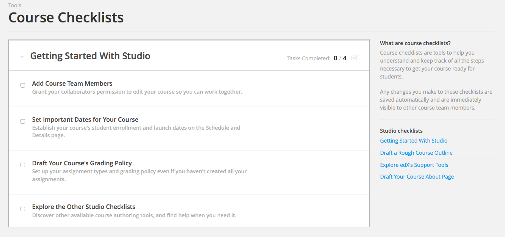

===================
Die Kurs-Checkliste
===================
Um die Durcharbeit der einzelnen Aufgaben zur Erstellung eines Kurses zu erleichtern gibt es innerhalb von Studio eine Checkliste die man dafür benutzten kann. 
Die Checkliste beinhaltet folgende Kategorien von Aufgaben:
	
	- Anfänge mit Studio
	- Erstellen eines groben Kurs-Entwurfs
	- Kennenlernen/Erforschen der edX Unterstützungswerkzeuge
	- Verfassen der Kurs-Informations-Seite

Zum Aufrufen der Checkliste wählen sie "Checkliste" im Werkzeuge-Menü

Um eine Aufgabe aus der Checkliste zu erfüllen, fahren Sie mit Ihrer Maus über die Schaltfläche der Aufgabe und klicken sie auf den darauf erscheinenden Knopf (blau). Dieser leitet sie zur eigentlichen Aufgabe mit ihrer Erklärung weiter.

Sie können die Checkliste je nach Belieben vergrößern oder verkleinern.
Alle Veränderungen sowie erfüllte Aufgaben werden automatisch gespeichert und können von anderen Teammitgliedern gesehen werden.