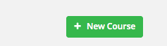
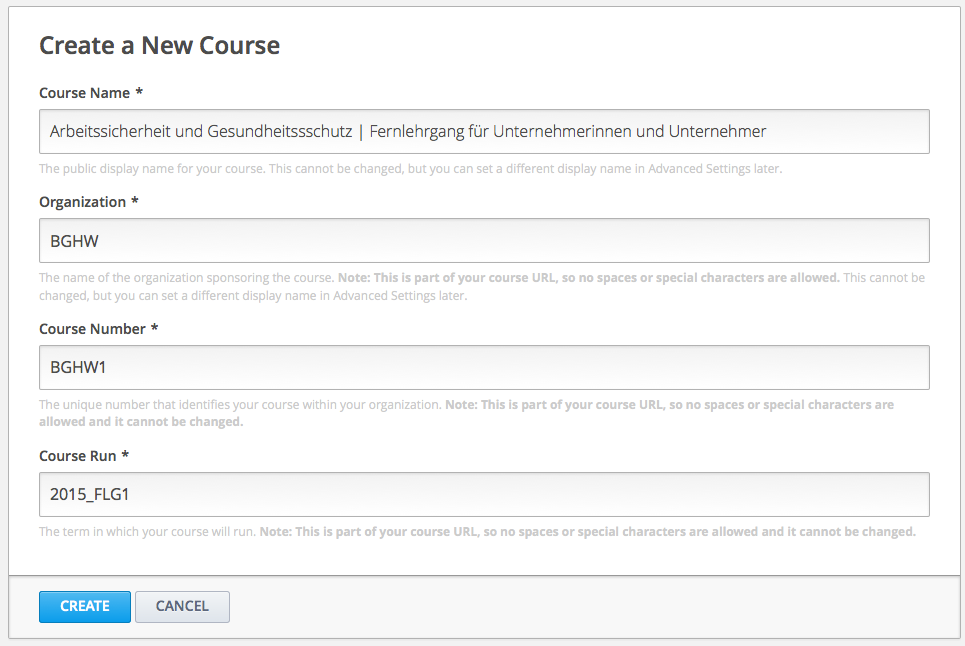

==================================
Wie erstellt man einen neuen Kurs?
==================================
Ein neuer Kurs lässt sich ganz einfach in vier Schritten erstellen:

1. Melden Sie sich bei Studio an.

----------------------------------------------------------------------------

2. Klicken Sie auf die Schaltfläche "Neuer Kurs"

----------------------------------------------------------------------------

3. Geben sie die gewünschten Informationen über den Kurs in die dafür 	 vorgesehenen Felder ein. 

Wichtig!
Achten Sie auf eine sorgfältige Eingabe der Informationen, da diese mit in die URL (web-Adresse) des Kurses eingebunden werden.
Um die URL zu verändern, nachdem der Kurs erstellt wurde, müssen Sie edX über die Hilfe-Seite (http://help.edge.edx.org) kontaktieren.
Da die eingegebenen Iformationen Teil der Kurs-URL werden, dürfen in den vier Feldern zusammen maximal 65 Zeichen stehen.

--------------------------------------------------------------------------

- **Kurs Name:** Hier geben Sie die genaue Bezeichnung für Ihren Kurs ein. Bespielsweise könnte der Name "Arbeitssicherheit & Gesundheitsschutz" lauten

--------------------------------------------------------------------------

- **Organisation:** Hier geben Sie Organisation an, von welcher aus dieser Kurs erstellt wird. Beispielsweise eine Universität oder Berufsgenossenschaft.

--------------------------------------------------------------------------

- **Kurs Nummer:** Hier geben Sie eine Buchstaben-Abkürzung für den im Kurs behandelten Sachverhalt sowie eine Nummer an. Zum Beispiel könnte die Kursnummer für "Arbeitssicherheit & Gesundheitsschutz" ASGS1 lauten.

--------------------------------------------------------------------------

- **Zeitraum:** Hier geben Sie den Zeitraum in welchem der Kurs statt finden soll in abgekürzter Form an. Für das zweite Semester 2014 könnte es bespielsweise T2_2014 lauten. Der eingegebene Zeitraum nimmt keinen Einfluss auf den tatsächlich von Ihnen festgelegten Starttermin.

.. note::

	|i| **Wichtig!** Falls Sie den Kurs weltweit öffentlich zugänglich machen möchten, achten sie darauf ein "x" in die Kursnummer einzufügen.

	.. |i| image:: images/i.png

4. Klicken Sie auf "Speichern"

