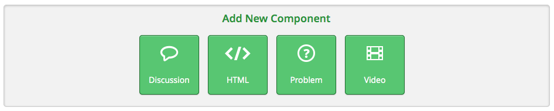
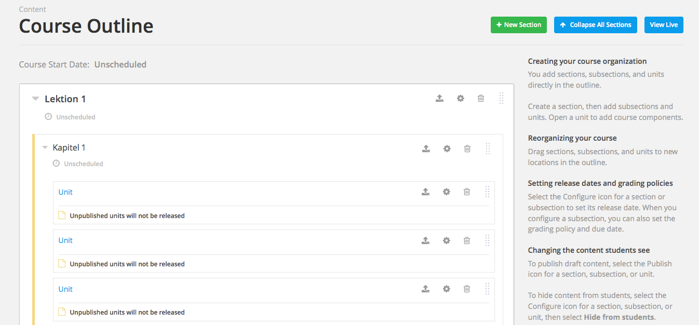
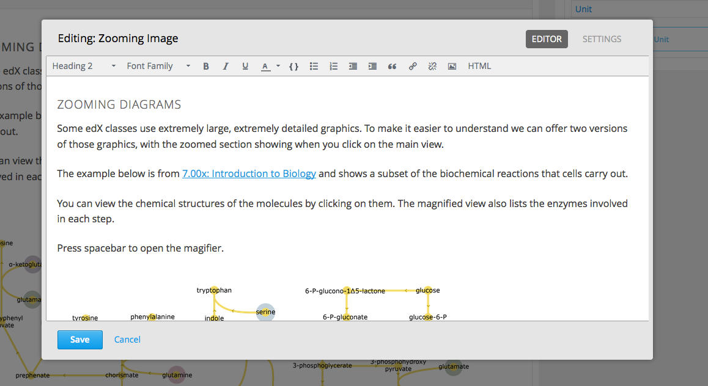

=================================================
Nutzen von Datei-URLs um Dateien zu referenzieren
=================================================
Nach dem Hochladen einer Datei werden zwei URLs erstellt, welche Sie nutzen können um auf diese Datei innerhalb Ihres Kurses zu referenzieren. Unter "Files & Uploads" sind die Studio-URL sowie die web-URL für jede Datei aufgelistet. 

	- Sie können die **Studio URL** nutzen um eine Datei oder ein Bild zu einer Lektion, einem Kurs-Update oder einem Kurs-Handout hinzuzufügen. Für eine ausführlichere Beschreibung klicken sie hier_.
	- Die **WEB URL** können Sie einerseits nutzen um eine Datei oder ein Bild zu einer massigen E-mail Nachricht hinzuzufügen. Klicken Sie Email an Kursteilnehmer senden für eine detailiertere Beschreibung

.. note::

	|i| **Wichtig!** Sie können die Datei sperren wenn Sie nicht wollen dass Jemand außerhalb ihres Kurses auf die Datei zugreifen kann. Wenn Sie die Datei sperren können nur angemeldete Kursteilnehmer über die WEB URL auf die Datei zugreifen. Für mehr Informationen siehe `Eine Datei sperren`__.

.. _Eine: http://edx.readthedocs.org/projects/edx-partner-course-staff/en/latest/building_course/course_files.html#lock-a-file

__ Eine_

.. _hier:

=====================================
Dateien in einen Kurs hinzufügen
=====================================
Wenn Sie den visuellen Editor nutzen, können sie viele verschiedene Dateien hinzufügen. Grundsätzlich unterscheidet man zwischen 4 Arten von Komponenten die hinzugefügt werden können.

**Diskussion:** Hier erstellen Sie eine Art Chatroom in der alle Kursteilnehmer über ein von Ihnen festgelegtes Thema diskutieren können.

**HTML-Datei:** Eine HTML_Datei kann ein einfacher Text sein, eine Bekanntmachung, ein Vollbild-Bild, ein IFrame_ ,ein Zoombild_ oder ein ganz normales Bild.

**Problemfrage:** Bei einer Problemfrage können Sie den Kursteilnehmern Problemfragen wie beispielsweise Multiple Choice Aufgaben stellen, die sie beantworten müssen. Die Antworten werden dann mit Ihren Lösungen verglichen und ausgewertet.

**Video:** hier fügt man natürlich Audiodateien ein :)

1. Begeben Sie sich in den Kurs/=> die Lektion/=> das Kapitel/=> die Unit in welche sie eine Datei hinzufügen möchten. 

----------------------------------------------------------------------------

2. Wählen Sie nun zuerst die Art von Datei welche sie dem Kurs hinzufügen möchten.

Die gewünschte Datei wird sofort erstellt und Sie können diese über die "Edit" Schaltfläche gleich nach Ihren Wünschen bearbeite. 

.. image:: images/yoloswag300.jpg

**Bei Bildern oder Videos** geben sie einfach nur die URL ein. 

----------------------------------------------------------------------------

.. _IFrame: 

**IFrame:** Bei einem IFrame bindet man eine externe Website in einen Artikel ein.

.. _Zoombild: 

**Zoombild:** Hierbei handelt es sich um ein Bild bei welchem eine Vergrößerung durch das überfahren mit dem Mauszeiger möglich ist.

