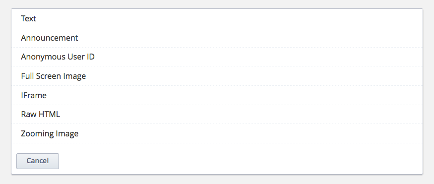
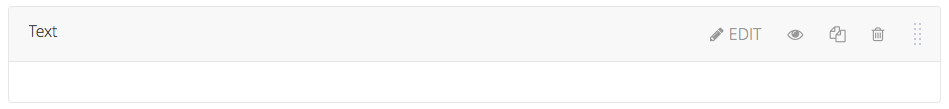
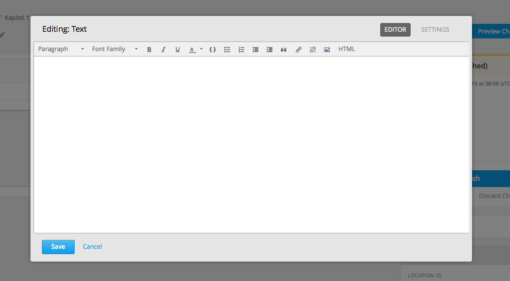

=================================================
Nutzen von Datei-URLs um Dateien zu referenzieren
=================================================
Nach dem Hochladen einer Datei werden zwei URLs erstellt, welche Sie nutzen können um auf diese Datei innerhalb Ihres Kurses zu referenzieren. Unter "Files & Uploads" sind die Studio-URL sowie die web-URL für jede Datei aufgelistet. 

	- Sie können die **Studio URL** nutzen um eine Datei oder ein Bild zu einer Lektion, einem Kurs-Update oder einem Kurs-Handout hinzuzufügen. Für eine detailierte Beschreibung dafür klicken sie hier_.
	- Die **WEB URL** können Sie einerseits nutzen um eine Datei oder ein Bild zu einer massigen E-mail Nachricht hinzuzufügen. Klicken Sie Email an Kursteilnehmer senden für eine detailiertere Beschreibung

.. note::

	|i| **Wichtig!** Sie können die Datei sperren wenn Sie nicht wollen dass Jemand außerhalb ihres Kurses auf die Datei zugreifen kann. Wenn Sie die Datei sperren können nur angemeldete Kursteilnehmer über die WEB URL auf die Datei zugreifen. Für mehr Informationen siehe `Eine Datei sperren`__.

.. |i| image:: images/i.png

.. _Eine: http://edx.readthedocs.org/projects/edx-partner-course-staff/en/latest/building_course/course_files.html#lock-a-file

__ Eine_

.. _hier:

=====================================
Komponenten in einen Kurs hinzufügen
=====================================
Wenn Sie den visuellen Editor nutzen, können sie viele verschiedene Komponenten hinzufügen welche in vier Gruppen zusammengefasst werden.
Im folgenden Text werden wir die wichtigsten Komponenten für Ihre Arbeit beschreiben.

.. image:: images/4mglk.png

**Diskussion:** Hier erstellen Sie eine Art Chatroom in der alle Kursteilnehmer über ein von Ihnen festgelegtes Thema diskutieren können.

**HTML-Datei:** Eine HTML_Datei kann ein einfacher Text sein, eine Bekanntmachung, ein Fullscreenimage_, ein IFrame_,ein Zoomimage_ oder ein ganz normales Bild.

**Problemfrage:** Bei einer Problemfrage können Sie den Kursteilnehmern Problemfragen wie beispielsweise Multiple Choice Aufgaben stellen, die sie beantworten müssen. Die Antworten werden dann mit Ihren Lösungen verglichen und ausgewertet.

**Video:** Hier kann sowohl auf ein Videofile als auch einen extern gehosteten Videostream referenziert werden.

1. Begeben Sie sich in den Kurs/=> die Lektion/=> das Kapitel/=> die Unit in welche sie eine Komponente hinzufügen möchten. 

.. image:: images/kulekaun.png

----------------------------------------------------------------------------

2. Wählen Sie nun zuerst die Art von Komponente welche sie dem Kurs hinzufügen möchten.

.. image:: images/pants.png

Die gewünschte Komponente wird sofort erstellt und kann über die "Edit" Schaltfläche gleich nach Ihren Wünschen bearbeitet werden.

.. image:: images/yoloswag300.jpg

**Bei Bildern oder Videos** geben sie einfach nur die URL ein.

----------------------------------------------------------------------------

.. _Zoombild: 

**Zoombild:** Hierbei handelt es sich um ein Bild bei welchem eine Vergrößerung durch das überfahren mit dem Mauszeiger möglich ist.

.. _Fullscreenimage:

.. _Zoomimage:

=====================================
Wichtige Komponenten speziell erklärt
=====================================

In diesem Bereich werden das Erstellen und Hinzufügen besonders wichtiger oder spezieller Komponenten gesondert erklärt. Die wichtigsten Komponenten sind:  

- Text_
- Fullscreenimages_
- Zoomimages
- IFrame

----------------------------------------------------------------------------

.. _Text:

**TEXT**

Die Text-Komponente finden Sie bei der Komponentenauswahl unter HTML an erster Stelle:

Nachdem Sie "Text" ausgewählt haben, klicken sie auf "Edit". 

Nun öffnet sich das Editorfenster und Sie können Ihren Text erstellen. 

Wenn Sie mit dem Erstellen Ihres Textes fertig sind, klicken sie auf "Save" zum Speichern.

---------------------------------------------------------------------------

.. _IFrame:

**IFRAME**

Bei einem IFrame bindet man eine externe Website in einen Artikel ein.
Die IFrame-Komponente befindet sich ebenfalls unter HTML bei der Komponentenauswahl:

Nachdem Sie "IFrame" ausgewählt haben, klicken sie auf "Edit". 

Nun öffnet sich das Editorfenster und Sie können einen Text welcher über dem IFrame stehen wird erstellen. Der eigentliche IFrame kann nicht über den normalen Editor konfiguriert werden. Dafür nutzt man den HTML Editor. 

.. image:: images/cod.png

Die letzten 3 Zeilen (hier rot makiert) beschreiben die Konfiguration des IFrames. Die Web-URL in der ersten der drei Zeilen gibt die Website an, welche mittels des IFrames angezeigt werden soll. Geben Sie hier die URL für die gewünschte Seite an. 

.. code:: html

    <iframe src="https://studio.edx.org/c4x/edX/DemoX/asset/eulerLineDemo.html" marginwidth="0" marginheight="0" scrolling="no" frameborder="0" height="402" width="402">You need an iFrame capable browser to view this.</iframe>

Nach der Web-URL sind die Attribute, welche den IFrame beschreiben, zusammen mit ihren jeweiligen Werten aufgelistet. Sie beschreiben und definieren den IFrame beispielsweise in Höhe, Breite, den Abstand zum Seitenrand und so weiter. Hier eine Auflistungs der meisten gängigen Attribute:

- height ( height="$"): Gibt die Höhe des IFrames in CSS-Pixeln an. "$" steht hierbei für einen beliebigen numeralen Wert
- width ( width="$"): Gibt die Breite des IFrames in CSS-Pixeln an. "$" steht hierbei für einen beliebigen numeralen Wert
- src (<iframe src="web-url"></iframe) legt die URL-Adresse des eingebundenen Dokuments fest
- sandbox ( sandbox="$"): Das Attribut aktiviert einen extra Satz von Einschränkungen für den Inhalt innerhalb des IFrames. Die Eingabe des Attributes ohne Wert (no-value) sorgt dafür, dass der IFrame mit maximalen Einschränkungen hinsichtlich des Surfens innerhalb des IFrames konfiguriert ist.
- scrolling ( scrolling="yes|no|auto"): Erlaubt oder deaktiviert das Scrollen innerhalb des IFrames.
- frameborder ( frameborder="1|0"):

.. _Fullscreenimages:

.. _Zoomimages:

